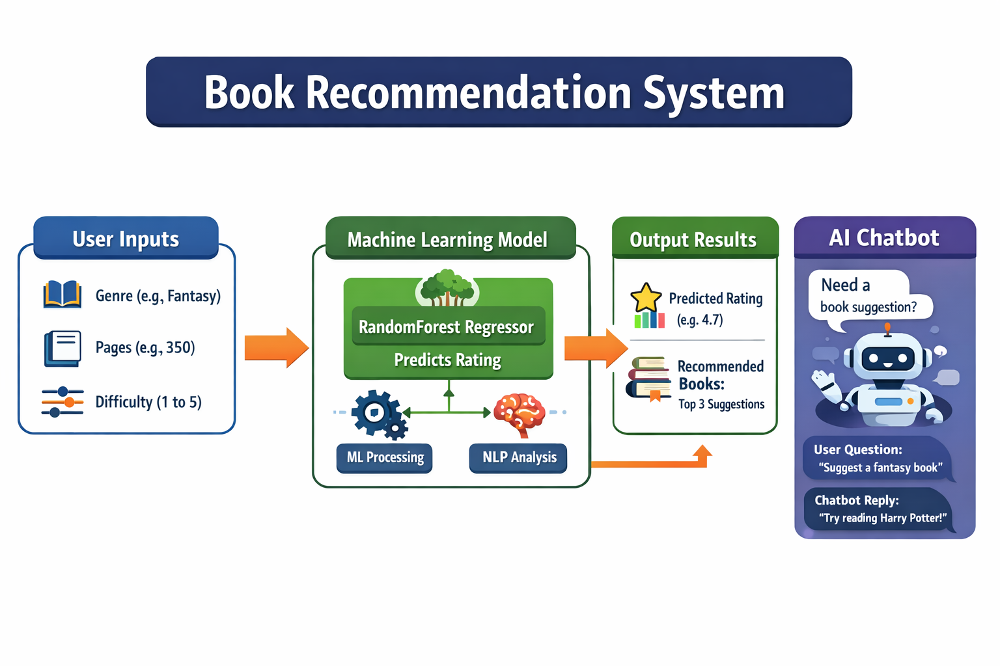

# Book-Recommendation-System
📚 1️⃣ What This System Does

This is a smart book recommendation system built with machine learning (ML) and AI.

It has three main components:

Book Rating Prediction (ML)

Uses a RandomForest Regressor to predict how much a user will like a book.

Trained on a dataset of books with their genre, pages, difficulty, and user ratings.

Helps recommend the best books for a user based on their preferences.

NLP Chatbot (AI)

Understands simple questions like “recommend a book” or “I like fantasy books”.

Uses TF-IDF and cosine similarity to find the most relevant answer.

Helps users interact with the system naturally, like a conversation.

Frontend Dashboard (React)

Clean dark-themed UI

Users can enter preferences, see predictions, and ask the chatbot for help.

📝 2️⃣ What Inputs You Provide for Prediction

To predict how much a user will like a book, the system needs three inputs:

Input	Type	Description
Genre	Text	Type of book (Fantasy, SelfHelp, Education)
Pages	Number	Number of pages in the book
Difficulty	Number	1 (easy) → 5 (very hard), reflects complexity of the book

Example Input:

{
  "genre": "Fantasy",
  "pages": 350,
  "difficulty": 2
}

🔮 3️⃣ What Outputs You Get

After providing inputs, the system gives two results:

Predicted Rating

A number between 1–5 showing how much you would like the book.

Higher rating → book is more likely to match your preference.

Recommended Books

Top 3 books from the dataset of the selected genre.

Sorted by actual user ratings.

Example Output:

{
  "predicted_rating": 4.8,
  "recommended_books": ["Harry Potter", "Lord of the Rings", "The Hobbit"]
}

🤔 4️⃣ How the System Works (Step-by-Step)

User chooses preferences (genre, pages, difficulty).

Backend uses RandomForest ML model to predict a rating.

Backend finds top books from dataset in that genre.

NLP chatbot can also answer questions or suggest books interactively.

Frontend shows results in a dark-themed, easy-to-use dashboard.

🎯 5️⃣ Why This System is Useful

For readers: Get personalized book suggestions.

For developers/ML learners: Example of real ML + AI integration.

For projects: Combines regression, NLP, and frontend skills in one system.  

# 1. Create virtual environment (recommended)
python -m venv venv

# 2. Activate virtual environment
# On Windows:
venv\Scripts\activate
# On Mac/Linux:
source venv/bin/activate

# 3. Install dependencies
pip install -r requirements.txt

# 4. Train the model
python train_model.py

# 5. Start the backend server
python app.py

